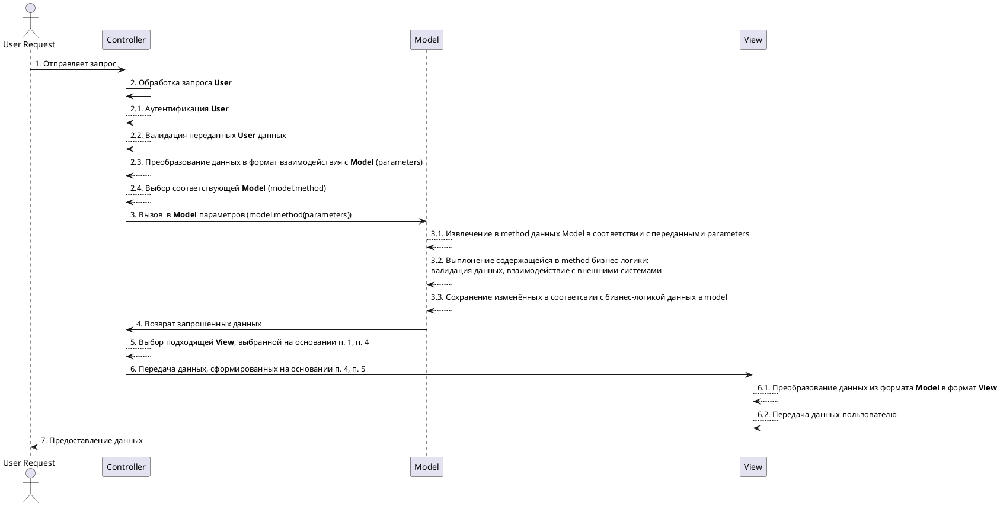
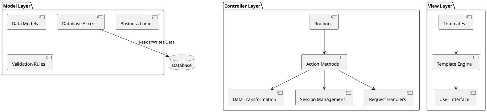

# Процесс Взаимодействия на уровне Приложения
## Процесс взаимодействия

## Уровень Controller
**Controller** в паттерне MVC (Model-View-Controller) отвечает за управление потоком приложения, выступает в качестве посредника между **Model** (данные/бизнес-логика) и **View** (пользовательский интерфейс).
Основные обязанности **Controller**:
- интерпретация пользовательских данных (Request);
- вызове соответствующей бизнес-логики в модели (Model);
- определение подходящего представления (View);того, какое представление следует отобразить. По сути, он организует реакцию приложения на взаимодействие с пользователем.
## Уровень Model
**Model** в паттерне MVC (Model-View-Controller) отвечает за управление данными, бизнес-логикой и правилами приложения. Она служит центральной частью архитектуры, в которой реализована вся основная функциональность. 
Основные обязанности **Model**:
- за хранение состояния приложения
- предоставление методов для доступа и манипулирования состоянием приложения;
- взаимодействие с базой данных или любыми внешними источниками данных.
## Уровень View
**View** в паттерне MVC (Model-View-Controller) отвечает за представление данных пользователю и обработку визуальных аспектов приложения. Он выступает в качестве презентационного слоя и занимается исключительно тем, как данные отображаются, форматируются и доставляются пользователю.
Основные обязанности:
- преобразование данных, полученных от **Controller**;
- отображение преобрвазованной информации **User** (удобном для пользователя формате, таком как HTML, JSON или XML).
# Диаграмма взаимодействия компонент

## Model Layer
Этот слой полностью независим и взаимодействует со слоем **Controller**. Акцент на способах хранения и обработки данных.
### Data Models
Структура данных, представляющая определённую сущность бизнес-логики (напр., Клиент).
### Business Logic
Алгоритмы, обрабатывающие требования бизнес-логики.
### Database Access
Обработка взаимодействия с базой данных.
## View Layer
Отвечает за представление данных пользователю в части форматирования и отображения.
### Templates
Файлы и компоненты, определяющие структуру отображения.
### Template Engine
Механизм обработки шаблона.
### UI (User Interface)
Отвечает за вывод на экран пользовательских данных.
## Controller Layer
Отвечает за ход исполнения потока приложения принимая пользовательские запросы и организуя взаимодействие с состоянием приложения (через модель) для вывода пользователю информации.
### Routing
Сопоставление пользовательского запроса с методом, который необходимо вызвать в контроллере.
### Action Method
Метод, обрабатывающий определённый пользовательский запрос. В **[[Action Method]]**  взаимодействие с **Model** для работы с состоянием приложения.
### Session Management
Управление пользовательскими сессиями, аутентификацией и авторизацией для проверки контроля доступа.
### Data Transformation
Подготовка данных, полученных из **Model** для отображения во **View**.
